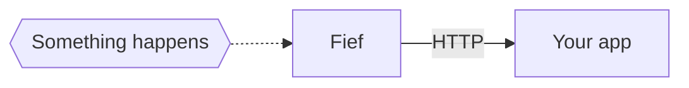
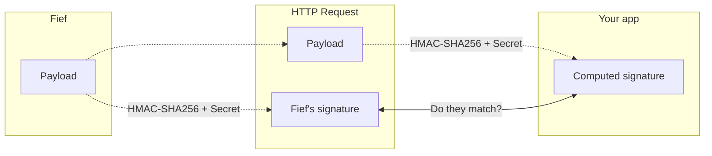
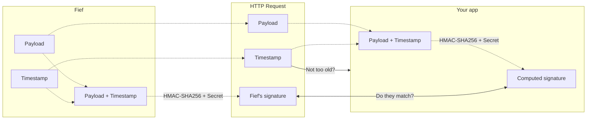

# Webhooks integration guide

You'll find in this guide insights and guidelines to integrate webhooks in your application.

--8<-- "reusables/webhook-callout.md"

## Configure your Webhook

You can create and manage your Webhooks from the admin dashboard. You can read more about it [here](../../configure/webhooks.md).

They can also be created programmatically using the Admin API, with the `/admin/api/webhooks/` endpoints.

## How Webhooks work?

Webhooks are a common technique in web applications to **trigger logic and workflows** across **different applications and processes**.

They generally work with **standard HTTP requests**. When an event happens on a service `A`, thi service will perform an HTTP request to a service `B` that wants to know about this event. The payload of this request usually consists of a JSON object with information about the event.

This approach is performant and easy-to-use because service `B` only needs to expose an HTTP endpoint and wait for incoming requests. It doesn't need to *poll* service `A` to check if something happened.



### Webhooks security

As you may have guessed, accepting webhooks involves to expose a **public HTTP endpoint on the internet**. Since this could be easily guessed by malicious users, they could very well send false events to your application!

So, how do we know if a webhook event truly comes for Fief? Several techniques exist, but we chose to implement a **signature approach**. Basically, we take the payload, i.e. the JSON data of the event and hash it using a cryptography algorithm (`HMAC-SHA256`) with a **secret**. This secret is the one you get when you create your Webhook.

Then, this signature is sent in the headers of the HTTP request we make to your application. This way, using the same technique, you can compute the very same signature: if they match, it means it's a legitimate request from Fief. If not, this is a malicious request that you should reject 🤨



Besides this mechanism, Fief adds a **timestamp** to the request headers. It protects us from replay attacks, where a malicious user could repeat a request they have intercepted before. All we need to do is to **reject requests that have a too old timestamp**. And to make sure the timestamp is not tampered, it's contatenated to the payload before generating the signature.



## Request specification

A Fief's webhook request is a standard **HTTP POST request** with a **JSON payload**.

### Headers

#### `X-Fief-Webhook-Timestamp`

The timestamp at which the request was issued. You shouldn't accept requests older than 5 minutes.


#### `X-Fief-Webhook-Signature`

The HMAC-SHA256 signature. It's computed by concatenating:

* The timestamp
* The character `.`
* The raw JSON payload as string

The resulting string is then used to compute an HMAC with the SHA256 hash function and your webhook secret. The result is serialized as an hexadecimal string.

### JSON payload

The payload consists of a JSON object with two keys:

* `event`: the name of the event that triggered the webhook
* `data`: the corresponding data of the event. Usually, it's a representation of the object that has been created, updated or deleted in database.

**Example**

```json
{
    "type": "user.created",
    "data": {
        "id": "de168e87-8b37-4f01-9e02-f7e5244f0be8"
        "email": "anne@bretagne.duchy",
        "is_active": true,
        "is_superuser": false,
        "is_verified": false,
        "fields": {
            "first_name": "Anne",
            "last_name": "De Bretagne"
        },
        "tenant_id": "4c124fb0-048e-448d-b2e7-6ba1bb03ec1",
        "tenant": {
            "id": "4c124fb0-048e-448d-b2e7-6ba1bb03ec1",
            "name": "Bretagne Duchy",
            "default": true,
            "slug": "",
            "registration_allowed": true,
            "theme_id": null,
            "logo_url": null
        }
    }
}
```

### Response

Your server should return a response with a status in the 200-range.

### Retries

If your server is unreachable or if it doesn't return a response with a success status code, Fief will try to send again the event **4 times**, waiting exponentially more each time.

* Attempt 1
* *(wait 15 seconds)* Attempt 2
* *(wait 60 seconds)* Attempt 3
* *(wait 120 seconds)* Attempt 4
* *(wait 240 seconds)* Attempt 5

Each attempt is [logged](../../configure/webhooks.md#view-webhook-logs), so you can check why the delivery has gone wrong.

## Code samples

### FastAPI

```py title="app.py"
--8<-- "examples/python/fastapi/webhook.py"
```

1. **Your Webhook secret**

    Don't forget to replace this with your own Webhook secret: this is how you'll be able to compute the proper signature.

    For security, you should set it in an environment variable so it doesn't get committed with your code.

2. **Retrieve the raw payload**

    It's important that you retrieve the raw payload instead of the parsed representation returned by your framework.

    Otherwise, we can't be sure we have the exact same string representation that were used when computing the original signature.

## What's next?

You can now receive notifications directly from Fief in your application! We can't wait to see the clever integrations and workflows you'll build.

To have more details about the different events and their structure, be sure to check the [Webhook events](./events.md) documentation.
