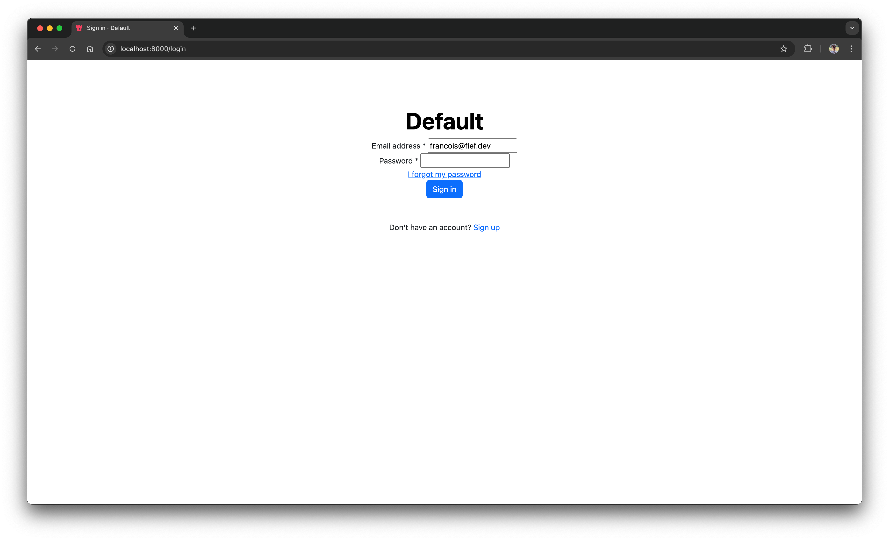

# Override authentication page templates

If you want to fully customize authentication pages (login, registration, forgot password, etc.), you can override the built-in templates. Fief templates are powered by [Jinja](https://jinja.palletsprojects.com/en/3.1.x/), a powerful templating system for Python.

## Step 1: implement your templates

We recommend you to start from the [built-in templates](https://github.com/fief-dev/fief/tree/main/fief/templates/auth) of Fief and copy them into a local folder. The files you override should have the **same name** as the original ones and nested in a folder named `auth`.

Here is a simple example of an override of `layout.html`, which is the base layout for all authentication pages, using the [Bootstrap framework](https://getbootstrap.com/).

```py title="templates/auth/layout.html"
--8<-- "examples/templates/templates/auth/layout.html"
```

## Step 2: adding your templates to your Docker build

You should now add your templates to your Docker image. For this, create a `Dockerfile` (if not already) in your project. In its simplest form, it can look like this:

```dockerfile title="Dockerfile"
--8<-- "examples/templates/Dockerfile"
```

Basically, we start from the base image, copy our templates and set the `OVERRIDE_TEMPLATES_DIRECTORY` environment variable.

!!! tip "You don't need to override every files"

    If you just want to override some files but not the others, you can just provide the one you're interested in. If some templates don't exist, Fief will simply fall back to the default ones.

## Step 3: build and run your image

Now, all you need is to build and run your image to see the result.

```sh
docker build -t fief-templates .
```


