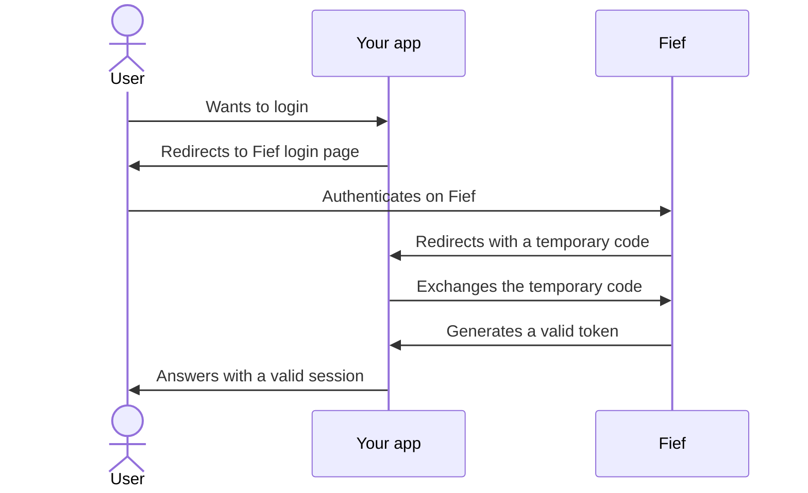

# Understand OAuth2

Fief uses the [OpenID Connect](https://openid.net/connect/) protocol, an identity layer on top of the well-known [OAuth2 protocol](https://oauth.net/2/) to **securely authenticate users**.

If you understand the basics of this protocol, you'll better understand how to integrate Fief to your own application.

You probably already used OAuth2 before: whenever you use a button like **Sign In with Google** or **Sign In with Facebook** on a website, you actually authenticate yourself using the OAuth2 protocol!

## Authentication flow

Schematically, a complete OAuth2 flow looks like this:

You see that we have three actors in this flow:

1. The **user**
2. Your **application** that needs to know the authenticated user
3. **Fief**, which is able to authenticate users and provide their information

This flow relies a lot on redirections:

1. The user first tries to access your application.
2. If they're not logged in, they are redirected to the Fief login page.
3. On this login page, the user will input its credentials, typically an email address and a password to authenticate themself.

At this point, **we don't have a valid user session yet**. In traditional applications, after a successful login, we do obtain a valid user session. However, in this context, the application needing the user session, your application, is not the same as the one that provides authentication, Fief.

That's why we have an additional step: Fief redirects to your application with a temporary code, called the **authorization code**. This code is then used by your application to call the Fief API and obtain a valid token in exchange. Finally, your application can save this token somewhere to maintain the user session.

The benefit of this approach is that your application never has access to the user credentials: the sensitive and difficult part is handled by Fief.

!!! tip "There are other OAuth2 variants"
    OAuth2 proposes several ways to achieve this kind of authentication flow.

    We showed here the **authorization code grant**, which is the most widely-used and the default in Fief.

## Scopes

A central part in OAuth2 is the concept of **scopes**. Basically, it determines what the application will be able to do or not with the user data.

For the user, this translates to the famous **consent screen**: it's a special page after a successful login telling them what the application wants to do with their data.

Once the access token is generated, it'll be tied to this **specific list of scopes** the user has granted. In your application, you'll be able to limit some actions based on those scopes.

As we said in introduction, we use the **OpenID Connect** protocol on top of OAuth2. With this protocol, we **always** have at least one scope, `openid`. It's a core scope giving access to the basic information of the user.

!!! tip "First-party clients"
    Since you'll use Fief to authenticate users on your own, official application, we introduced the concept of **first-party** clients. When a user logs in on a client configured as first-party, the consent screen is bypassed and every scopes asked are implicitly granted.

    You can read more about this in the [dedicated section](../configure/clients.md#first-party-clients).

!!! bug "Limitations"
    In the future, you'll be able to create your own set of scopes in Fief.

## Access Token and ID Token

After a successful authentication flow, your application will get two different tokens: an **access token** and an **ID token**.

The first one, the **access token**, is a secret value that'll authenticate the user on your application. It's tied to a specific user and a list of scopes.

On the other hand, the **ID token** is a value containing all the basic information about the authenticated user, like its email and other personal information. It'll be very useful in your application if you need for example to display the email of the current user.

For security reasons, both of them have a **limited lifetime**. At some point, we'll need to make another OAuth2 authentication flow again to retrieve fresh tokens.

!!! tip "Those are JWT"
    The access token and the ID token are both generated as **JSON Web Tokens** (JWT). JWT is a widely-used standard to secure data contained in a standard JSON object.

    Typically, JWT are **cryptographically signed**. It means that your application is able to **certify that the tokens you get are true and authentic** tokens generated by Fief, and not forged by a malicious attacker. This is critical since we use those to authenticate users into your app.

    The technical details around this are a bit complex but you can read more about on the [official JWT documentation](https://jwt.io/introduction).

## Let's try it for real!

Before starting to implement Fief in your own application, we'll perform an OAuth2 authentication on your own workspace using the built-in tools of Fief.
