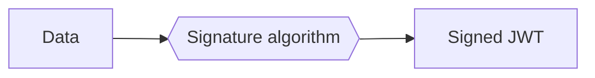
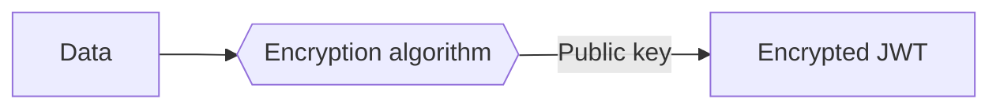
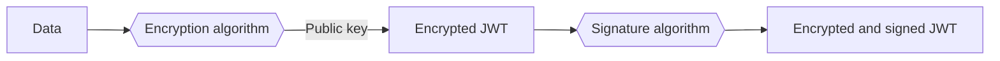

# ID Token encryption

In [Understand OAuth2](../getting-started/oauth2.md#access-token-and-id-token) section, we said that, after a successful authentication, you get two different tokens: an **access token** and an **ID token**.

The ID token is a value containing all the basic information about the authenticated user, like its id, email and profile information from [user fields](../getting-started/user-fields.md). For security and convenience, this data is encoded as a **JSON Web Token (JWT)**.

Before showing how to enable its encryption, let's explain how JWT work and why encryption is interesting.

## What are JWT?

JWT is a widely-used standard to secure and encode JSON data. For example, let's take the following JSON data, which is typical of what you could find in an ID token generated by Fief:

```json
{
    "iss": "https://bretagne.localhost:8000/secondary",
    "sub": "6c0e7f94-6af3-47ad-8599-6345a5a193cd",
    "email": "anne@nantes.city",
    "tenant_id": "3a85b89c-a232-4e2c-9d51-62501d8b6248",
    "is_active": true,
    "is_superuser": false,
    "is_verified": false,
    "fields": {
        "given_name": "Anne",
        "onboarding_done": false
    },
    "at_hash": "xWsDb_ALRF-uu_oKA16NBQ",
    "aud": [
        "YoiOW3KxPGJOvf3IAOXt8rVpXEX-IencR8j7GYKx5YQ"
    ],
    "auth_time": 1664352285,
    "azp": "YoiOW3KxPGJOvf3IAOXt8rVpXEX-IencR8j7GYKx5YQ",
    "c_hash": "1eTVhuCXj-Vz49DjpubmKg",
    "exp": 1664355888,
    "iat": 1664352288
}
```

If we encode this data as a JWT, here is what it looks like:

```
eyJhbGciOiJSUzI1NiJ9.eyJhdF9oYXNoIjoieFdzRGJfQUxSRi11dV9vS0ExNk5CUSIsImF1ZCI6WyJZb2lPVzNLeFBHSk92ZjNJQU9YdDhyVnBYRVgtSWVuY1I4ajdHWUt4NVlRIl0sImF1dGhfdGltZSI6MTY2NDM1MjI4NSwiYXpwIjoiWW9pT1czS3hQR0pPdmYzSUFPWHQ4clZwWEVYLUllbmNSOGo3R1lLeDVZUSIsImNfaGFzaCI6IjFlVFZodUNYai1WejQ5RGpwdWJtS2ciLCJlbWFpbCI6ImFubmVAbmFudGVzLmNpdHkiLCJleHAiOjE2NjQzNTU4ODgsImZpZWxkcyI6eyJnaXZlbl9uYW1lIjoiQW5uZSIsIm9uYm9hcmRpbmdfZG9uZSI6ZmFsc2V9LCJpYXQiOjE2NjQzNTIyODgsImlzX2FjdGl2ZSI6dHJ1ZSwiaXNfc3VwZXJ1c2VyIjpmYWxzZSwiaXNfdmVyaWZpZWQiOmZhbHNlLCJpc3MiOiJodHRwczovL2JyZXRhZ25lLmxvY2FsaG9zdDo4MDAwL3NlY29uZGFyeSIsInN1YiI6IjZjMGU3Zjk0LTZhZjMtNDdhZC04NTk5LTYzNDVhNWExOTNjZCIsInRlbmFudF9pZCI6IjNhODViODljLWEyMzItNGUyYy05ZDUxLTYyNTAxZDhiNjI0OCJ9.Rqe5DiaNR53pYEa8qaC_6TiUsvYzPNqmu0sJuu_Jx1ot3Ql9peEIYJOfkaas1M7E-DEKy_i0jXmdnsyU5uUIyQ
```

At first, we could think this data is encrypted and can't be read without a key. Actually, it's just a standard [base64 encoding](https://en.wikipedia.org/wiki/Base64) and it's very easy to decode. If you want to see it by yourself, you can copy-paste the value above into the [JWT.io debugger](https://jwt.io/#debugger-io): you'll see the data decoded!


So, why do we bother with JWT then? If you look closely at the debugger, you'll see there are **three parts** in the JWT, separated by a dot:

1. The **Header**, in red.
2. The **Data**, in purple which contains our base64-encoded JSON.
3. The **Signature**, in blue.

The **signature** is actually the main benefit of the JWT. It's a cryptographic technique allowing us to ensure the **data** has not been tampered or replaced by a malicious user: we're sure this is legitimate data generated by the Fief server.

We also use JWT for **access tokens**: thanks to the signature, we can be sure it's a valid access token just by checking the signature, without having to make a request to the server. This is super convenient!

Schematically, here is the creation process of a signed JWT:



## Why encryption is needed?

Ok, so we have our ID token as a JWT, and we can check the **authenticity** of the data. However, as we shown, the data can be **easily decoded** by anyone who could read the ID token.

Since the ID token may contain **personal information**, like email, postal address or phone number, it may pose **confidentiality issues**.

Fortunately, JWT accept a wide range of cryptographic algorithms, including **assymetric encryption**. In a nutshell, those algorithms use a pair of keys, a **public** one and a **secret** one. If we encrypt the data with the public key, it can only be decoded using the private key: the data remains private if we don't have this key.

Schematically, it looks like this:



However, there is a problem: the data is now encrypted, but it's **not signed anymore**. In this case, a malicious user could easily tamper or replace the data, encrypt it with the public key and return it to us. We could decrypt it, but we couldn't be sure it's authentic data from the server.

The solution is actually simple: take the encrypted JWT and **wrap it in another JWT** using a signature algorithm! This technique is called **nested JWT**. Hence, we have this process:



Now, we have the best of both worlds: we can check the **authenticity** of the data while preserving its **confidentiality**. This is what we do when we enable **ID Token encryption**.

## Enable ID Token encryption

In Fief, ID Token encryption can be enabled per [client](../getting-started/clients.md). From the admin dashboard, click on the client on which you want to enable ID Token encryption and, in its detail modal, click on the **Generate key** button.


Fief will generate a key pair for you. Then, a modal will open with your **private encryption key**. For security purposes, Fief will only keep the **public one**. It means that **only you** will be able to decrypt the data in the ID Token. Keep it safe and secret!


### Configure your application for ID Token encryption

You need now to configure your application so it can decode the ID Token. If you use our official libraries, all you need to do is to pass the key you copied above when initializing the Fief client:

=== "Python"

    ```py
    fief = Fief(
        "https://example.fief.dev",
        "YOUR_CLIENT_ID",
        "YOUR_CLIENT_SECRET",
        encryption_key="YOUR_ENCRYPTION_KEY",
    )
    ```

=== "JavaScript"

    ```ts
    const fief = new Fief({
        baseURL: 'https://example.fief.dev',
        clientId: 'YOUR_CLIENT_ID',
        clientSecret: 'YOUR_CLIENT_SECRET',
        encryptionKey: 'YOUR_ENCRYPTION_KEY',
    });
    ```

The client will then take care of decrypting the data for you.

---

In other languages, **use a JWT library** to decrypt the ID token:

1. Decrypt the encrypted JWT with your encryption key.
2. The resulting `claims` is the signed JWT.
3. Check the signature and decode the data of this signed JWT.

!!! tip "Draw inspiration from our Python implementation"
    If you need an example of how to do this, you can draw inspiration from our [Python implementation](https://github.com/fief-dev/fief-python/blob/main/fief_client/client.py#L241-L271).

### Regenerate encryption key

If you need to reset your encryption key because it was compromised or because you lost it, you can click on the **Regenerate key** button in the client details to generate a new one.


