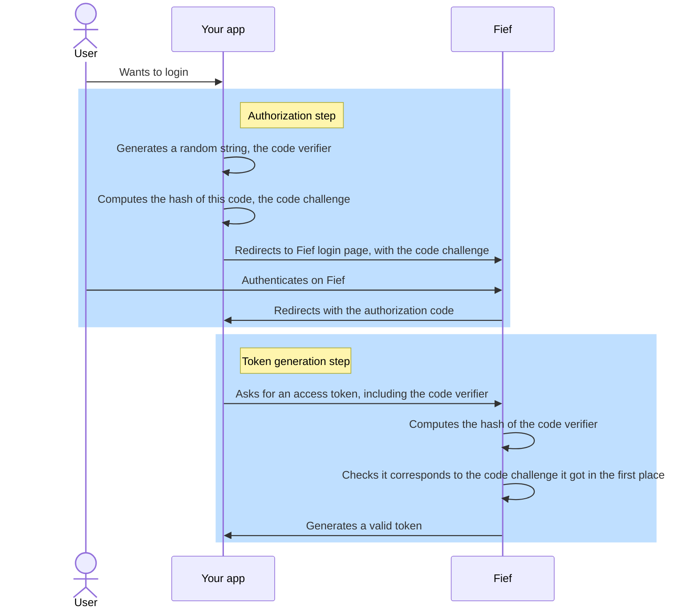

# PKCE

Proof Key for Code Exchange (PKCE) is an extension of the [OAuth2 protocol](https://www.rfc-editor.org/rfc/rfc7636) to help secure **public clients**.

--8<-- "reusables/client-callout.md"

## Rationale

As we mentioned in a [previous section](../getting-started/clients.md#public-clients), clients are considered **public** when the client secret can't be properly protected. This is usually the case for **JavaScript applications** and **mobile applications**, where the secret could be easily discovered in the source code.

In OAuth2 protocol, when the user has successfully authenticated, they are redirected to your application with a temporary code, called the **authorization code**. This code is then used by your application to call the Fief API and obtain a valid token in exchange. For this exchange to happen, the protocol requires that you provide the **client secret**, to prove that you are allowed to make such requests.

However, how could we do that for public clients where we don't have the client secret? That's the purpose of PKCE! In a nutshell, your application will **generate a temporary secret** each time we want to authenticate a user.

Schematically, here is the process:



Basically, the client generates a random string, the **code verifier**, makes a hash out of it, the **code challenge**, and keep them both in memory.

In the authorization step, the client only sends the code challenge. The server will keep this value in memory.

In the token generation step, the client now sends the **code verifier**. The server will then compute the hash the same way the client did and compare it with the challenge it got in the authorization step.

In a way, it's quite similar to how web applications handle user passwords: the server only keep the hashed value, and when the user logs in it computes the hash and compares it with the one in database.

!!! tip "PKCE can also be used with confidential clients"
    While initally designed for public clients, PKCE can also be used with confidential clients, as an extra security layer.

## Use PKCE with Fief

Fief **enforces** the use of PKCE for **public clients**: you must pass the `code_challenge` and `code_challenge_method` to the `/authorize` URL.

### JavaScript integration

Our official client comes with all the tools you need to perform PKCE.

!!! tip "Browser and React integrations do it automatically!"
    Actually, if you use our [browser](../integrate/javascript/browser.md) or [React](../integrate/javascript/react.md) integration, PKCE is already handled automatically!

---

If you need more control you can use the [`crypto` module](https://fief-dev.github.io/fief-js/modules/index.crypto.html) to generate the code verifier and challenge. Then, you can directly pass them to [`getAuthURL`](https://fief-dev.github.io/fief-js/classes/index.Fief.html#getAuthURL) and [`authCallback`](https://fief-dev.github.io/fief-js/classes/index.Fief.html#authCallback).

```ts
const codeVerifier = await fief.crypto.generateCodeVerifier();
const codeChallenge = await fief.crypto.getCodeChallenge(codeVerifier, 'S256');
const authURL = await fief.getAuthURL({
    redirectURI: 'http://localhost:8000/callback',
    scope: ['openid'],
    codeChallenge,
    codeChallengeMethod: 'S256',
);
```

```ts
const [tokens, userinfo] = await fief.authCallback(
    'CODE',
    'http://localhost:8000/callback',
    codeVerifier,
);
```

### Other languages

If you need to implement PKCE for other languages, you'll need to:

1. Generate a cryptographic-safe random string of 128 characters.
2. Compute the SHA-256 hash of this value and encode it in base64.

!!! tip "Draw inspiration from our JavaScript implementation"
    If you need an example of how to do this, you can draw inspiration from our [JavaScript implementation](https://github.com/fief-dev/fief-js/blob/main/src/crypto.ts#L88-L127).

Then, you'll need to pass `code_challenge` and `code_challenge_method` parameters to the authorization URL:

```http
GET /authorize
    ?response_type=code
    &client_id=YOUR_CLIENT_ID
    &redirect_uri=http://localhost:8080/callback.html
    &scope=openid
    &code_challenge=mvmfsFiKEO7h5OfvxtXxJPeteUmIJpXIWhcauYbgovs
    &code_challenge_method=S256
HTTP/1.1
Host: example.fief.dev
```

Finally, when requesting the token, don't forget to pass `code_verifier`:

```http
POST /token HTTP/1.1
Host: example.fief.dev
Content-Type: application/x-www-form-urlencoded
Content-Length: 155

grant_type=authorization_code
&client_id=YOUR_CLIENT_ID
&code=AUTHORIZATION_CODE
&redirect_uri=http://localhost:8080/callback.html
&code_verifier=CODE_VERIFIER
```
