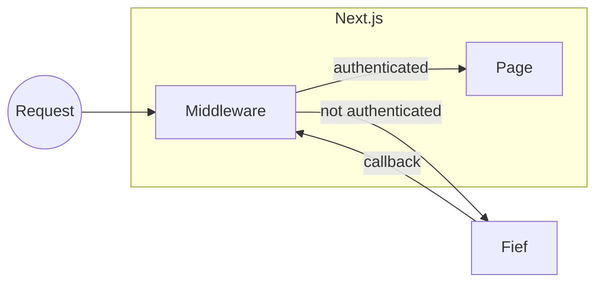

# Next.js (App Router)

[Next.js](https://nextjs.org/) is a highly popular JavaScript framework for Server-Side Rendering. The Fief JavaScript client provides tools dedicated to Next.js. Let's see how to use them!

## Install the client

```bash
npm install @fief/fief
```

## The big picture

To make integration seamless, we use a **middleware** to handle the authentication process. When the user is successfully authenticated, this middleware will set headers that can be read by layouts and pages to retrieve user information.



### Middleware

In most recent versions, Next.js introduced [Middleware](https://nextjs.org/docs/advanced-features/middleware). It's a useful mechanism allowing us to define logic **before every request**. Next.js team designed it to be highly performant: it's executed by their [Edge Runtime technology](https://nextjs.org/docs/api-reference/edge-runtime), a special runtime different from Node.js.

In Fief implementation, we'll use the Middleware to **check if the user is authenticated** and if they have the right scope and permissions.

Besides, it'll also automatically handle special routes dedicated to authentication:

* `/login` will redirect to Fief authentication page.
* `/auth-callback` will complete the **OAuth2 callback** and **set the session cookie**;
* `/logout` will clear the session cookie and redirect to Fief logout.

### Pages and layout

The actual [pages and layouts](https://nextjs.org/docs/app/building-your-application/routing/pages-and-layouts) of our app will then only have to read the information set by the middleware on the server side to get information about the user and render the components, passing the data through props as needed.

## Configure your project

!!! question "This is for you if..."
    - [x] You use Next.js with **App Router**.

!!! abstract "Prerequisites"
    - [x] Bootstrap a Next.js project as described in [Automatic Setup](https://nextjs.org/docs/getting-started#automatic-setup) section of the Next.js documentation.
    - [x] Allow the following [Redirect URI](../../../configure/clients.md#redirect-uris) on your Fief Client: `http://localhost:3000/auth-callback`

### 1. Create a `fief` module

Let's create a `fief.ts` module at the root of the project. It'll contain the basic instantiation of Fief helpers.

```ts title="fief.ts"
--8<-- "examples/javascript/nextjs/app-router/fief.ts"
```

1. **Define a session cookie name constant**

    We'll use a cookie to maintain the user session.

    For convenience, we set its name in a constant.

2. **Fief client instantiation**

    As we showed in the [standard JavaScript section](../index.md), we instantiate here a Fief client here with the base tenant URL and client credentials.

3. **Fief helper for Next.js**

    This is the helper doing the tedious work for you with Next.js.

    We'll review here the required parameters. You can have a complete list of parameters in the [reference documentation](https://fief-dev.github.io/fief-js/interfaces/nextjs.FiefAuthParameters.html).

4. **The Fief client**

    The first mandatory parameter is the Fief client we just created above.

5. **The session cookie name**

    We pass the constant we defined above.

6. **Absolute redirect URI**

    After the user has succesfully authenticated on Fief, our user will need to be redirected to our application so we can get the access token and set our session.

    This constant is an absolute URL to the `/auth-callback` route the Middleware will handle.

7. **Absolute redirect URI after logout**

    When logging out, the user is redirected to Fief so the session stored on Fief's side can also be cleared.

    After that, Fief will redirect the user to your application. This parameter allows you to set the page where they should be redirected.

    Typically, this can be the home page of your application.

### 2. Add the Middleware

If not already, create a `middleware.ts` module at the root of the project.

```ts title="middleware.ts"
--8<-- "examples/javascript/nextjs/app-router/middleware.ts"
```

1. **Import the `fiefAuth` instance from `fief` module**

    This is the instance of [FiefAuth](https://fief-dev.github.io/fief-js/classes/nextjs.FiefAuth.html) we created in the previous section.

2. **Create an instance of the middleware**

    Using the [`fiefAuth.middleware`](https://fief-dev.github.io/fief-js/classes/nextjs.FiefAuth.html#middleware) method, we create an instance of a Next.js Middleware that'll check the authentication on our routes.

    All it needs is an array of routes, consisting of the elements described below.

3. **Match the `/private` path**

    By doing this, we tell the middleware to ensure a user is authenticated before accessing the `/private` page.

    If they're not, they will be automatically redirected to the Fief login page.

4. **Match all the routes starting with `/castles`**

    The `matcher` property follows [the same syntax](https://nextjs.org/docs/advanced-features/middleware#matcher) as the one supported by Next.js.

    It means that you can match a single path, a group of paths or a specific pattern.

    Here, we match all the routes starting with `/castles`. We'll be sure that the user is authenticated before accessing those routes.

5. **Require a permission to access `/castles` routes**

    You can add [`AuthenticateRequestParameters`](https://fief-dev.github.io/fief-js/interfaces/server.AuthenticateRequestParameters.html) to a path matcher.

    Here, we require the user to have `castles:read` permission to access those routes.

    If they don't have the required permission, the middleware will redirect them to the `/forbidden` page.

6. **Catch all the other routes**

    To be able to get the user information even for routes that don't require authentication (think, for example, a home page where you render a header with a user menu), we need a last matcher that catches all the route.

    It ensures the middleware does its job and set the necessary headers for the pages and layouts. Notice how we set the `optional: true` option: it means we won't redirect the user to the login page if they're not authenticated.

7. **Define the Middleware function**

    This is the standard way to define a [Next.js Middleware](https://nextjs.org/docs/advanced-features/middleware).

8. **Call the `authMiddleware` function**

    You can now call the `authMiddleware` function with the `request` object.

    This function returns a `NextResponse`, so you can very well add your own middleware logic if needed to further customize it.

!!! warning "Don't mix it with default `config` matcher"
    The [Next.js Middleware documentation](https://nextjs.org/docs/advanced-features/middleware#matcher) shows you how to filter the execution of your Middleware using path matchers.

    ```ts
    export const config = {
        matcher: ['/about/:path*', '/dashboard/:path*'],
    }
    ```

    When using Fief middleware, it's better to avoid it to make sure the authentication logic is called on the routes you defined.

    Indeed, let's imagine you have this configuration:

    ```ts
    const authMiddleware = fiefAuth.middleware([
        {
            matcher: '/private',
            parameters: {},
        },
    ]);
    // ❌ Don't do this
    export const config = {
        matcher: ['/another-route'],
    }
    ```

    The authentication middleware will **never** be called in this configuration, because Next.js will only run the Middleware for `/another-route`, not `/private`.

### 4. Create a `forbidden` page

When the user tries to access a page they are not authorized to see, e.g. if they lack a scope or a permission; the Middleware will automatically render the `pages/forbidden.tsx` page.

You should implement it to show a useful error message to the user. It can be as simple as the following:

```ts title="/app/forbidden/page.tsx"
--8<-- "examples/javascript/nextjs/app-router/app/forbidden/page.tsx"
```

### 5. Build a root layout

The root layout is useful to render common components in all parts of your application. Typically, you may want to render a header showing the authenticated user or a login button.

It can look like this:

```ts title="/app/layout.tsx"
--8<-- "examples/javascript/nextjs/app-router/app/layout.tsx"
```

1. **Import the `fiefAuth` instance from `fief` module**

    This is the instance of [FiefAuth](https://fief-dev.github.io/fief-js/classes/nextjs.FiefAuth.html) we created at the beginning.

2. **Get user information**

    Use the [`getUserInfo` method](https://fief-dev.github.io/fief-js/classes/nextjs.FiefAuth.html#getUserInfo) to retrieve information about the authenticated user, or `null` if not authenticated.

3. **A simple demo `Header` component**

    This is a simple demo component. Notice how we pass down user information as props.

## Good to go!

Our project is now ready! You can run it with:

```bash
npm run dev
```

If you go to [http://localhost:3000](http://localhost:3000), you'll see the index public page.


If you click on the [**Private page**](http://localhost:3000/private) link in the header, you'll be automatically redirected on Fief authentication pages. After a successful login, you'll be taken back to the `/private` page.


As you can see, we can **show the email address** of the current user. This is done quite simply using again `getUserInfo`.

```ts title="/app/private/page.tsx"
--8<-- "examples/javascript/nextjs/app-router/app/private/page.tsx"
```

Now, let's try to go to the [**Castles / Index**](http://localhost:3000/castles) page. If you've not added the correct permission to the user, you'll probably see the **Forbidden** page:


If you [assign the correct permission to the user](../../../configure/users.md#assign-a-permission) and authenticate again, you'll see the actual page.


As you can see, we are able to show the **list of permissions granted to the user**. It can be useful to hide or show parts of the UI depending on those permissions.

You can easily access them using the [`getAccessTokenInfo`](https://fief-dev.github.io/fief-js/classes/nextjs.FiefAuth.html#getAccessTokenInfo) method.

```ts title="/app/castles/page.tsx"
--8<-- "examples/javascript/nextjs/app-router/app/castles/page.tsx"
```

If you click on [**Logout**](http://localhost:3000/logout), your session will be cleared and you will be redirected to the index page.

## Summary

Your Next.js project is now ready and can easily control the authentication and permissions of your users! Here are the most important things to remember while developing your app:

1. If you want to protect a page, add it to the `authMiddleware` paths in `middleware.ts`.
2. If you want to access user information or permissions, use [`getUserInfo`](https://fief-dev.github.io/fief-js/classes/nextjs.FiefAuth.html#getUserInfo) and [`getAccessTokenInfo`](https://fief-dev.github.io/fief-js/classes/nextjs.FiefAuth.html#getAccessTokenInfo) methods.

If you want to go further and customize more aspects, like the path to login or logout routes, be sure to check the [library reference](https://fief-dev.github.io/fief-js/modules/nextjs.html).
