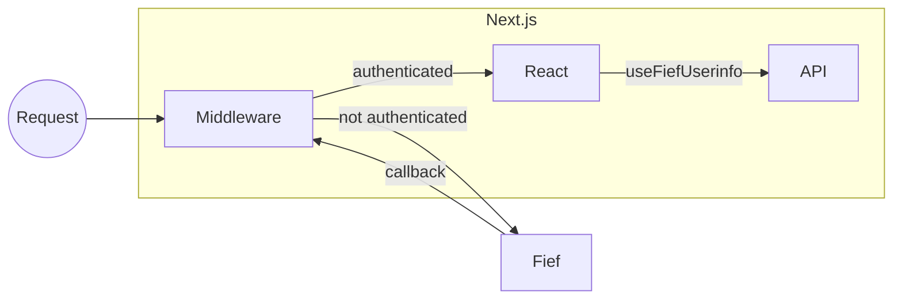

# Next.js

[Next.js](https://nextjs.org/) is a highly popular JavaScript framework for Server-Side Rendering. It tries to combine the reactivity of React and the performance of backend technologies. As such, it has many subtelties and comes with very specific challenges, especially regarding user authentication.

To help you with this, the Fief JavaScript client provides tools dedicated to Next.js. Let's see how to use them!

## Install the client

```bash
npm install @fief/fief
```

## The big picture

As we said, Next.js is a hybrid framework combining backend technologies and frontend technologies. It means that managing authentication will have to happen at several levels.



### Middleware level

In most recent versions, Next.js introduced [Middleware](https://nextjs.org/docs/advanced-features/middleware). It's a useful mechanism allowing us to define logic **before every request**. Next.js team designed it to be highly performant: it's executed by their [Edge Runtime technology](https://nextjs.org/docs/api-reference/edge-runtime), a special runtime different from Node.js.

In Fief implementation, we'll use the Middleware to **check if the user is authenticated** and if they have the right scope and permissions.

Besides, it'll also automatically handle special routes dedicated to authentication:

* `/login` will redirect to Fief authentication page.
* `/auth-callback` will complete the **OAuth2 callback** and **set the session cookie**;
* `/logout` will clear the session cookie and redirect to Fief logout.

### API level

Next.js allows us to define [API routes](https://nextjs.org/docs/api-routes/introduction). They can be used to perform backend logic and are executed by a standard Node.js runtime.

In Fief implemenetation, we'll define an API route allowing the React application to **retrieve the current user information**.

### React level

Finally, the React level is the interface shown to the user.

In Fief implementation, we provide **hooks** allowing you to retrieve the current user information and authentication state.

## Configure your project

!!! question "This is for you if..."
    - [x] You'll use Next.js.

!!! abstract "Prerequisites"
    - [x] Bootstrap a Next.js project as described in [Automatic Setup](https://nextjs.org/docs/getting-started#automatic-setup) section of the Next.js documentation.
    - [x] Allow the following [Redirect URI](../../../configure/clients.md#redirect-uris) on your Fief Client: `http://localhost:3000/auth-callback`

### 1. Create a `fief` module

Let's create a `fief.ts` module at the root of the project. It'll contain the basic instantiation of Fief helpers.

```ts title="fief.ts"
--8<-- "examples/javascript/nextjs/fief.ts"
```

1. **Define a session cookie name constant**

    We'll use a cookie to maintain the user session.

    For convenience, we set its name in a constant.

2. **Fief client instantiation**

    As we showed in the [standard JavaScript section](../index.md), we instantiate here a Fief client here with the base tenant URL and client credentials.

3. **Implement a user information cache**

    To make sure we don't call the Fief API every time we want the user data, we'll cache it in our application. It'll be way more performant!

    To do this, we impement a class following the [`IUserInfoCache`](https://fief-dev.github.io/fief-js/interfaces/server.IUserInfoCache.html) interface.

    In this example, we use very simple approach that will just store the data in memory. If your server is rebooted, the cache will be lost.

    It can work quite well when starting, but you'll probably need more robust approaches in the long run, like writing to a Redis store. The good thing is that you'll only need to change this class when the time comes!

4. **Fief helper for Next.js**

    This is the helper doing the tedious work for you with Next.js.

    We'll review here the required parameters. You can have a complete list of parameters in the [reference documentation](https://fief-dev.github.io/fief-js/interfaces/nextjs.FiefAuthParameters.html).

5. **The Fief client**

    The first mandatory parameter is the Fief client we just created above.

6. **The session cookie name**

    We pass the constant we defined above.

7. **Absolute redirect URI**

    After the user has succesfully authenticated on Fief, our user will need to be redirected to our application so we can get the access token and set our session.

    This constant is an absolute URL to the `/auth-callback` route the Middleware will handle.

8. **Absolute redirect URI after logout**

    When logging out, the user is redirected to Fief so the session stored on Fief's side can also be cleared.

    After that, Fief will redirect the user to your application. This parameter allows you to set the page where they should be redirected.

    Typically, this can be the home page of your application.

9. **We use our user information cache**

    We tell about our user information cache, so the helper can use it to save and retrieve the data.

### 2. Add the Middleware

If not already, create a `middleware.ts` module at the root of the project.

```ts title="middleware.ts"
--8<-- "examples/javascript/nextjs/middleware.ts"
```

1. **Import the `fiefAuth` instance from `fief` module**

    This is the instance of [FiefAuth](https://fief-dev.github.io/fief-js/classes/nextjs.FiefAuth.html) we created in the previous section.

2. **Create an instance of the middleware**

    Using the [`fiefAuth.middleware`](https://fief-dev.github.io/fief-js/classes/nextjs.FiefAuth.html#middleware) method, we create an instance of a Next.js Middleware that'll check the authentication on our routes.

    All it needs is an array of routes, consisting of the elements described below.

3. **Match the `/private` path**

    By doing this, we tell the middleware to ensure a user is authenticated before accessing the `/private` page.

    If they're not, they will be automatically redirected to the Fief login page.

4. **Match all the routes starting with `/castles`**

    The `matcher` property follows [the same syntax](https://nextjs.org/docs/advanced-features/middleware#matcher) as the one supported by Next.js.

    It means that you can match a single path, a group of paths or a specific pattern.

    Here, we match all the routes starting with `/castles`. We'll be sure that the user is authenticated before accessing those routes.

5. **Require a permission to access `/castles` routes**

    You can add [`AuthenticateRequestParameters`](https://fief-dev.github.io/fief-js/interfaces/server.AuthenticateRequestParameters.html) to a path matcher.

    Here, we require the user to have `castles:read` permission to access those routes.

    If they don't have the required permission, the middleware will redirect them to the `/forbidden` page.

6. **Define the Middleware function**

    This is the standard way to define a [Next.js Middleware](https://nextjs.org/docs/advanced-features/middleware).

7. **Call the `authMiddleware` function**

    You can now call the `authMiddleware` function with the `request` object.

    This function returns a `NextResponse`, so you can very well add your own middleware logic if needed to further customize it.

!!! warning "Don't mix it with default `config` matcher"
    The [Next.js Middleware documentation](https://nextjs.org/docs/advanced-features/middleware#matcher) shows you how to filter the execution of your Middleware using path matchers.

    ```ts
    export const config = {
        matcher: ['/about/:path*', '/dashboard/:path*'],
    }
    ```

    When using Fief middleware, it's better to avoid it to make sure the authentication logic is called on the routes you defined.

    Indeed, let's imagine you have this configuration:

    ```ts
    const authMiddleware = fiefAuth.middleware([
        {
            matcher: '/private',
            parameters: {},
        },
    ]);
    // ❌ Don't do this
    export const config = {
        matcher: ['/another-route'],
    }
    ```

    The authentication middleware will **never** be called in this configuration, because Next.js will only run the Middleware for `/another-route`, not `/private`.

### 3. Add the `current-user` API

In the `/pages/api` directory, create a `current-user.ts` module.

```ts title="/pages/api/current-user.ts"
--8<-- "examples/javascript/nextjs/pages/api/current-user.ts"
```

1. **Import the `fiefAuth` instance from `fief` module**

    This is the instance of [FiefAuth](https://fief-dev.github.io/fief-js/classes/nextjs.FiefAuth.html) we created in the first section.

2. **Instantiate and export the `currentUser` API route**

    Thanks to the [`fiefAuth.currentUser`](https://fief-dev.github.io/fief-js/classes/nextjs.FiefAuth.html#currentUser) method, you can generate an API route that'll return the user information of the authenticated user.

    Nothing more to do!

### 4. Create a `forbidden` page

When the user tries to access a page they are not authorized to see, e.g. if they lack a scope or a permission; the Middleware will automatically render the `pages/forbidden.tsx` page.

You should implement it to show a useful error message to the user. It can be as simple as the following:

```ts title="/pages/forbidden.tsx"
--8<-- "examples/javascript/nextjs/pages/forbidden.tsx"
```

### 5. Prepare your React application

On the React side, we'll need to declare a context so the frontend application can store the authentication state and user information in its state. It'll also let us use a set of useful hooks.

Your `/pages/_app.tsx` file should look like this:

```ts title="/pages/_app.tsx"
--8<-- "examples/javascript/nextjs/pages/_app.tsx"
```

1. **Wrap `Component` with `FiefAuthProvider`**

    `FiefAuthProvider` will provide the necessary React context so we can use the hooks in our application.

    The only property required is `currentUserPath`, which should be the path of the current user API we defined in the previous section.

2. **A simple demo `Header` component**

    This is a simple demo component to show you how to use hooks. We'll detail it in the next sections.

!!! warning "In React context, the import path is `@fief/fief/nextjs/react`"

    For technical reasons, components and hooks need to be imported from `@fief/fief/nextjs/react`, **not** `@fief/fief/nextjs`.

## Good to go!

Our project is now ready! You can run it with:

```bash
npm run dev
```

If you go to [http://localhost:3000](http://localhost:3000), you'll see the index public page.


If you click on the [**Private page**](http://localhost:3000/private) link in the header, you'll be automatically redirected on Fief authentication pages. After a successful login, you'll be taken back to the `/private` page.


As you can see, we can **show the email address** of the current user. This is done quite simply using the provided React hooks:

```ts title="/pages/private.tsx"
--8<-- "examples/javascript/nextjs/pages/private.tsx"
```

1. **`useFiefUserinfo` gives you access to the current user information**

    The hook [`useFiefUserinfo`](https://fief-dev.github.io/fief-js/functions/nextjs.useFiefUserinfo.html) returns you a [`FiefUserInfo`](https://fief-dev.github.io/fief-js/interfaces/index.FiefUserInfo.html) object you can use to work with the user data.

Now, let's try to go to the [**Castles / Index**](http://localhost:3000/castles) page. If you've not added the correct permission to the user, you'll probably see the **Forbidden** page:


If you [assign the correct permission to the user](../../../configure/users.md#assign-a-permission) and authenticate again, you'll see the actual page.


As you can see, we are able to show the **list of permissions granted to the user**. It can be useful to hide or show parts of the UI depending on those permissions.

You can easily access them using the [`useFiefAccessTokenInfo`](https://fief-dev.github.io/fief-js/functions/nextjs.useFiefAccessTokenInfo.html) hook.

```ts title="/pages/castles/index.tsx"
--8<-- "examples/javascript/nextjs/pages/castles/index.tsx"
```

If you click on [**Logout**](http://localhost:3000/logout), your session will be cleared and you will be redirected to the index page.

Generating links to login, logout and other pages is no different from a standard Next.js links. Just be sure you use the right path!

```ts title="/components/Header/Header.tsx"
--8<-- "examples/javascript/nextjs/components/Header/Header.tsx"
```

1. **Use `useFiefIsAuthenticated` hook to know if a user is authenticated**

    [`useFiefIsAuthenticated`](https://fief-dev.github.io/fief-js/functions/nextjs.useFiefIsAuthenticated.html) is very useful to quickly check if there is a valid session and adapt the UI.

2. **Show a Login link if not authenticated**

    Simply add a **Link** component pointing to the `/login` path. This path is automatically handled by the Middleware.

3. **Show a Logout link if authenticated**

    Simply add a **Link** component pointing to the `/logout` path. This path is automatically handled by the Middleware.

## Summary

You're Next.js project is now ready and can easily control the authentication and permissions of your users! Here are the most important things to remember while developing your app:

1. If you want to protect a page, add it to the `authMiddleware` paths in `middleware.ts`.
2. If you want to access user information or permissions, use [`useFiefUserinfo`](https://fief-dev.github.io/fief-js/functions/nextjs.useFiefUserinfo.html) and [`useFiefAccessTokenInfo`](https://fief-dev.github.io/fief-js/functions/nextjs.useFiefAccessTokenInfo.html) hooks.

If you want to go further and customize more aspects, like the path to login or logout routes, be sure to check the [library reference](https://fief-dev.github.io/fief-js/modules/nextjs.html).

## Get access token

In somes contexts, you might need to call a separate API backend that will expect a valid access token to authenticate the request. For example, this is what we show in the [FastAPI example](../../python/fastapi.md#api-example).

In this case, your Next.js took care of authenticating the user and has a valid access token in session. Now, you only need to get this access token and set it as `Authorization` header when making requests to your API backend.

With Next.js, you can do this in two contexts:

### 1. From `getServerSideProps`

[`getServerSideProps`](https://nextjs.org/docs/basic-features/data-fetching/get-server-side-props) is a Next.js feature to fetch data server-side, in a pure SSR approach. It's a good candidate to fetch the data you want to show to the users from your API, like a list of items.

The Fief Middleware takes care of setting the authenticated user id and access token as `X-FiefAuth-User-Id` and `X-FiefAuth-Access-Token` request headers.

```ts
export const getServerSideProps: GetServerSideProps = async (context) => {
  const userId = context.req.headers['x-fiefauth-user-id'];
  const accessToken = context.req.headers['x-fiefauth-access-token'];
  const res = await fetch('https://api.bretagne.duchy', {
    headers: {
      Authorization: `Bearer ${accessToken}`,
    },
  });
  const data = await res.json()
  // Pass data to the page via props
  return { props: { data } }
}
```

### 2. From React

Of course, you might need to call your API from the frontend side as well, typically when the user needs to create or update new data.

For this, you can get the access token with the [`useFiefAccessTokenInfo`](https://fief-dev.github.io/fief-js/functions/nextjs.useFiefAccessTokenInfo.html) hook.

```ts
const accessTokenInfo = useFiefAccessTokenInfo();

const submitData = useCallback(async (data) => {
  await fetch('https://api.bretagne.duchy', {
    method: 'POST',
    headers: {
      Authorization: `Bearer ${accessTokenInfo?.access_token}`,
    },
    body: JSON.stringify(data),
  });
}, [accessTokenInfo]);
```
