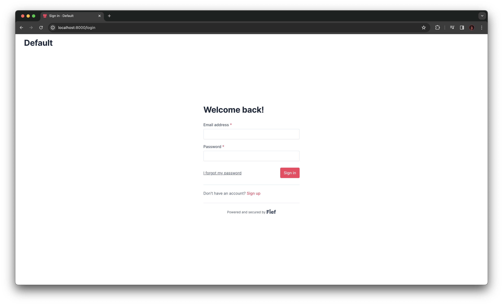

# FastAPI

[FastAPI](https://fastapi.tiangolo.com/) is one of the fastest-growing Python web framework. It features impressive performance and top-notch developer experience. Actually, the Fief server itself is implemented with FastAPI!

The Fief Python client provides tools to help you integrate Fief authentication in your FastAPI project. Let's see how to use them!

## Install the client

Install the Fief client with the optional FastAPI dependencies:

```bash
pip install "fief-client[fastapi]"
```

## Minimal example

In this first example, we'll leverage the interactive documentation generated by FastAPI to perform the OAuth2 authentication. The goal here is just to show you **how to protect your API route with a Fief access token**.

```py title="app.py"
--8<-- "examples/python/fastapi/minimal.py"
```

1. **Fief client instantiation**

    As we showed in the [standard Python section](./index.md), we instantiate here a Fief client here with the base tenant URL and client credentials.

    Notice here that we use the `FiefAsync` class. FastAPI being an ASGI framework, it's always nice to take advantage of `asyncio` capabilities.

2. **OpenAPI security scheme**

    FastAPI uses those security schemes to generate an interactive documentation showing the right interface to authenticate with the API. We use here a standard OAuth2 interface.

3. **Fief helper for FastAPI**

    This is the helper doing the tedious work for you with FastAPI. All it needs is an instance of the Fief client and the scheme.

4. **`current_user` dependency**

    This is where the magic happens: in pure FastAPI style, `FiefAuth` gives you a `current_user` dependency to check for the access token and optionally for required scopes.

    If everything goes well, you'll get a dictionary containing the ID of the user, the list of allowed scopes and the raw access token.

And that's about it!

### Test it

You can run this example just like you would do for any FastAPI app:

```bash
uvicorn app:app
```

Open [http://localhost:8000/docs](http://localhost:8000/docs) to access the interactive documentation.


Let's try first the `/user` endpoint:


We get an 401 error! That's expected: **we are not authenticated yet**!

Let's fix that: click on the **Authorize** button to start the authentication process. You'll need to provide your client ID and secret and select the scopes.


Click on the **Authorize** button: you are redirected to the Fief login page.



Upon successful login, you will be redirected back to the interactive documentation: a valid access token has been generated!


You can now try the `/user` endpoint to check the result:


Notice how the interactive documentation passed the access token in the `Authorization` header of the request!

Besides, the response does contain the user ID, the list of allowed scopes and the access token itself.

### Summary

With this example, we showed you how to use the `current_user` dependency to protect your API endpoints.

However, we didn't implement routes to perform the OAuth2 authentication flow: we completely relied on the interactive documentation to do it for us.
