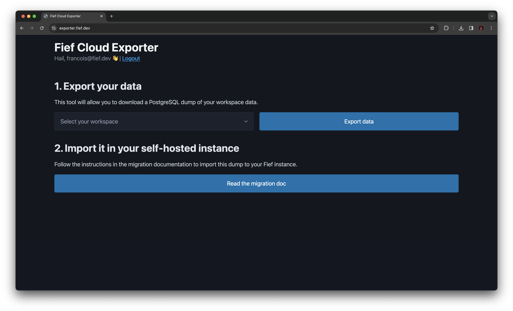

---
hide:
  - navigation
---

# Migrate to 0.28+

Starting Fief 0.28.0, we removed the multiple workspaces feature, which was more suited for our discontinued cloud environment rather than a self-hosting approach.

As such, if you were hosting a Fief instance before 0.28.0, you'll need to perform a few operations to migrate data and be compatible with the new versions.

!!! info "If you're a new user of Fief, this is not for you"
    This migration procedure only concerns users who ran an instance before version 0.28.0.

## How it worked before?

Basically, we had a "main" database which was responsible to "map" each workspaces to a "sub-database". If you look at the database you defined, you'll see the following tables:

* `admin_api_key`
* `admin_session_tokens`
* `alembic_version`
* `workspace_users`
* `workspaces`

If you look inside `workspaces`, you'll see the definition of the workspace in your Fief instance:

| id                                   | created_at                    | updated_at                    | name         | domain            | database_type | database_host | database_port | database_username | database_password | database_name | alembic_revision | database_ssl_mode | users_count | database_use_schema | database_table_prefix |
| :----------------------------------- | :---------------------------- | :---------------------------- | :----------- | :---------------- | :------------ | :------------ | :------------ | :---------------- | :---------------- | :------------ | :--------------- | :---------------- | :---------- | :------------------ | :-------------------- |
| 08e952f1-8a79-4672-99f8-ea6919cd4692 | 2022-04-17 09:15:20.066176+00 | 2024-02-09 00:06:00.415373+00 | My workspace | fief.mydomain.com | NULL          | NULL          | NULL          | NULL              | NULL              | NULL          | 6c06c7d908a7     | NULL              | 1194        | false               | fief_                 |

The ID of your workspace, here `08e952f1-8a79-4672-99f8-ea6919cd4692` is important: it'll determine the location of the actual workspace data in your DB.

## Migrate data

### I'm using PostgreSQL

With PostgreSQL, each workspace has its own schema, named after their ID. What we'll do here is to **move all the tables from the schema** to the main schema, `public`.

Here is a query to do so. We assume the schema is named `08e952f1-8a79-4672-99f8-ea6919cd4692`. **Don't forget to modify it with your actual workspace ID**.

```sql
DO
$$
DECLARE
    table_name text;
BEGIN
    FOR table_name IN (SELECT tablename FROM pg_tables WHERE schemaname = '08e952f1-8a79-4672-99f8-ea6919cd4692')
    LOOP
        EXECUTE format('ALTER TABLE "08e952f1-8a79-4672-99f8-ea6919cd4692".%I SET SCHEMA public', table_name);
    END LOOP;
END;
$$;
```

### I'm using MySQL

With MySQL, we created databases for each workspace, named after their ID. What we'll do here is to **move all the tables to the main database**.

We assume the workspace database is named `08e952f1-8a79-4672-99f8-ea6919cd4692` and your main database, `my_database`. **Don't forget to modify it with your actual values**.


```sql
RENAME TABLE "08e952f1-8a79-4672-99f8-ea6919cd4692".fief_alembic_version TO my_database.fief_alembic_version;
RENAME TABLE "08e952f1-8a79-4672-99f8-ea6919cd4692".fief_audit_logs TO my_database.fief_audit_logs;
RENAME TABLE "08e952f1-8a79-4672-99f8-ea6919cd4692".fief_authorization_codes TO my_database.fief_authorization_codes;
RENAME TABLE "08e952f1-8a79-4672-99f8-ea6919cd4692".fief_clients TO my_database.fief_clients;
RENAME TABLE "08e952f1-8a79-4672-99f8-ea6919cd4692".fief_email_domains TO my_database.fief_email_domains;
RENAME TABLE "08e952f1-8a79-4672-99f8-ea6919cd4692".fief_email_templates TO my_database.fief_email_templates;
RENAME TABLE "08e952f1-8a79-4672-99f8-ea6919cd4692".fief_email_verifications TO my_database.fief_email_verifications;
RENAME TABLE "08e952f1-8a79-4672-99f8-ea6919cd4692".fief_grants TO my_database.fief_grants;
RENAME TABLE "08e952f1-8a79-4672-99f8-ea6919cd4692".fief_login_sessions TO my_database.fief_login_sessions;
RENAME TABLE "08e952f1-8a79-4672-99f8-ea6919cd4692".fief_oauth_accounts TO my_database.fief_oauth_accounts;
RENAME TABLE "08e952f1-8a79-4672-99f8-ea6919cd4692".fief_oauth_providers TO my_database.fief_oauth_providers;
RENAME TABLE "08e952f1-8a79-4672-99f8-ea6919cd4692".fief_oauth_sessions TO my_database.fief_oauth_sessions;
RENAME TABLE "08e952f1-8a79-4672-99f8-ea6919cd4692".fief_permissions TO my_database.fief_permissions;
RENAME TABLE "08e952f1-8a79-4672-99f8-ea6919cd4692".fief_refresh_tokens TO my_database.fief_refresh_tokens;
RENAME TABLE "08e952f1-8a79-4672-99f8-ea6919cd4692".fief_registration_sessions TO my_database.fief_registration_sessions;
RENAME TABLE "08e952f1-8a79-4672-99f8-ea6919cd4692".fief_roles TO my_database.fief_roles;
RENAME TABLE "08e952f1-8a79-4672-99f8-ea6919cd4692".fief_roles_permissions TO my_database.fief_roles_permissions;
RENAME TABLE "08e952f1-8a79-4672-99f8-ea6919cd4692".fief_session_tokens TO my_database.fief_session_tokens;
RENAME TABLE "08e952f1-8a79-4672-99f8-ea6919cd4692".fief_tenants TO my_database.fief_tenants;
RENAME TABLE "08e952f1-8a79-4672-99f8-ea6919cd4692".fief_tenants_oauth_providers TO my_database.fief_tenants_oauth_providers;
RENAME TABLE "08e952f1-8a79-4672-99f8-ea6919cd4692".fief_themes TO my_database.fief_themes;
RENAME TABLE "08e952f1-8a79-4672-99f8-ea6919cd4692".fief_user_field_values TO my_database.fief_user_field_values;
RENAME TABLE "08e952f1-8a79-4672-99f8-ea6919cd4692".fief_user_fields TO my_database.fief_user_fields;
RENAME TABLE "08e952f1-8a79-4672-99f8-ea6919cd4692".fief_user_permissions TO my_database.fief_user_permissions;
RENAME TABLE "08e952f1-8a79-4672-99f8-ea6919cd4692".fief_user_roles TO my_database.fief_user_roles;
RENAME TABLE "08e952f1-8a79-4672-99f8-ea6919cd4692".fief_users TO my_database.fief_users;
RENAME TABLE "08e952f1-8a79-4672-99f8-ea6919cd4692".fief_webhook_logs TO my_database.fief_webhook_logs;
RENAME TABLE "08e952f1-8a79-4672-99f8-ea6919cd4692".fief_webhooks TO my_database.fief_webhooks;
```

### I'm using SQLite

SQLite stores database in a file. By default, on our Docker image, those files are located in `/data/db`. The main database is called `fief.db` and each workspace has a database file named after their ID.

What we'll do is to simply rename your workspace database so it matches the main one. We assume the workspace database is named `08e952f1-8a79-4672-99f8-ea6919cd4692` and your main database, `fief.db`. **Don't forget to modify it with your actual values**.

```bash
mv fief.db fief.db.bak  # Backup the old database
mv 08e952f1-8a79-4672-99f8-ea6919cd4692 fief.db
```

### Fief Cloud

For Fief Cloud users, we've created a dedicated tool to export your data: [https://exporter.fief.dev](https://exporter.fief.dev)

!!! warning "Only compatible with PostgreSQL"
    The exported data will only be importable into a PostgreSQL database, so you'll need to use PostgreSQL when running your Fief instance.

#### 1. Export your data

The [exporter tool](https://exporter.fief.dev) will connect to your Fief's account to show you the list of your workspaces. Select the workspace you want to export and click on **Export data**. Your SQL dump will be downloaded automatically.



#### 2. Import it in your instance

The resulting file is a valid PostgreSQL dump. You can directly import it in your database using `psql`:

```bash
psql -h localhost -p 5432 -U fief -d fief < ~/fief_dump_Example.sql
```

Make sure to adapt your *host*, *port*, *username* and *database* to your own database server.

#### 3. Set your encryption key

Some values in the database are encrypted using the Fernet algorithm. You'll find your encryption key **at the top of your dump file**:

```bash
head -n1 ~/fief_dump_Example.sql
```

```
-- ENCRYPTION_KEY=YourEncryptionKeyValue
```

You should set this value as `ENCRYPTION_KEY` in your [environment variables](./self-hosting/environment-variables.md#secrets).

## Next steps

On the next startup, the new version of Fief will automatically upgrade the schema while keeping your existing data.

### Admin user

Admin permissions are now directly controlled by a specific [role](./configure/access-control.md) on your instance. Thus, you'll need to grant it to your user account. You can do so using the Fief CLI:

```bash
fief grant-admin-role anne@bretagne.duchy
```

### Admin API keys

Please note that [Admin API Keys](./configure/api-keys.md) are **not migrated**. You'll need to create them again and update the token in your API calls accordingly.

### Cleanup old tables

After checking that everything works correctly, you can safely delete the following tables:

* `admin_api_key`
* `admin_session_tokens`
* `alembic_version`
* `workspace_users`
* `workspaces`

## What if I had multiple workspaces?

Unfortunately, if you have multiple workspaces, you'll need to run one instance per workspace.

From our experience, this was in most cases not really useful and you probably better rely on the [Tenants](./configure/tenants.md).

## I've problems migrating 😞

If you encounter problems or if something is not clear, ask us on the [GitHub Discussions](https://github.com/orgs/fief-dev/discussions) forum. We're here to help!
