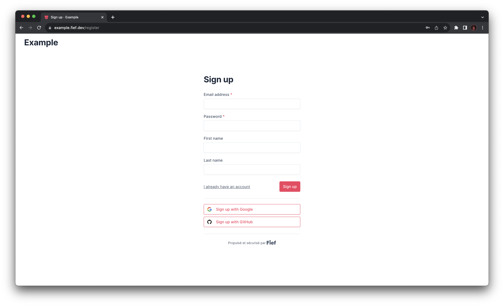
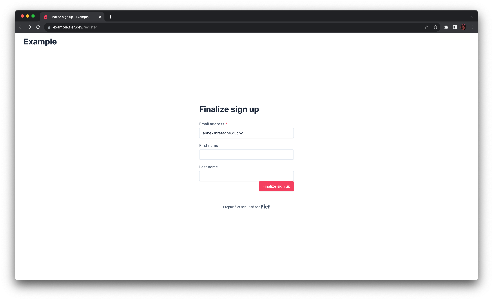
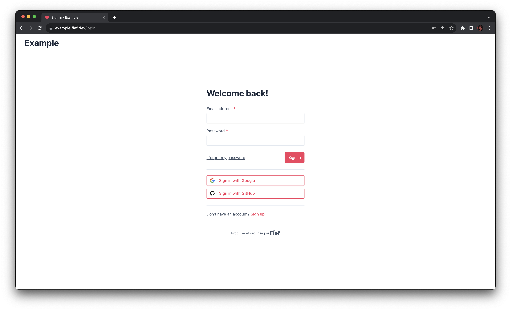
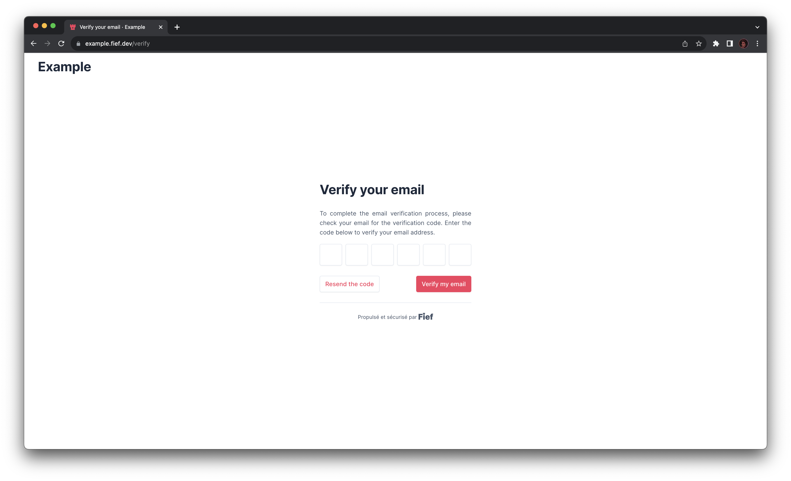
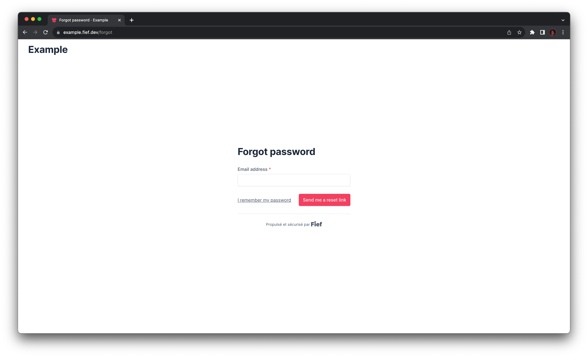
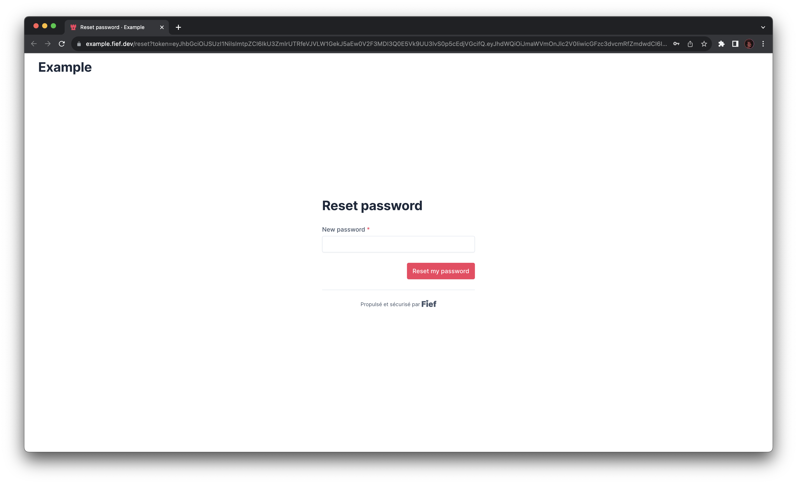
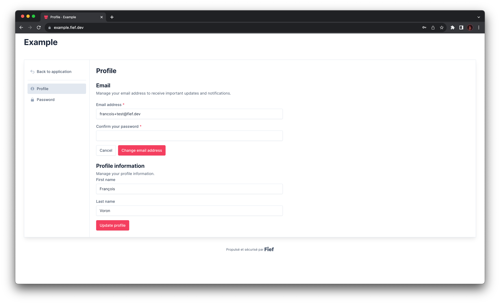
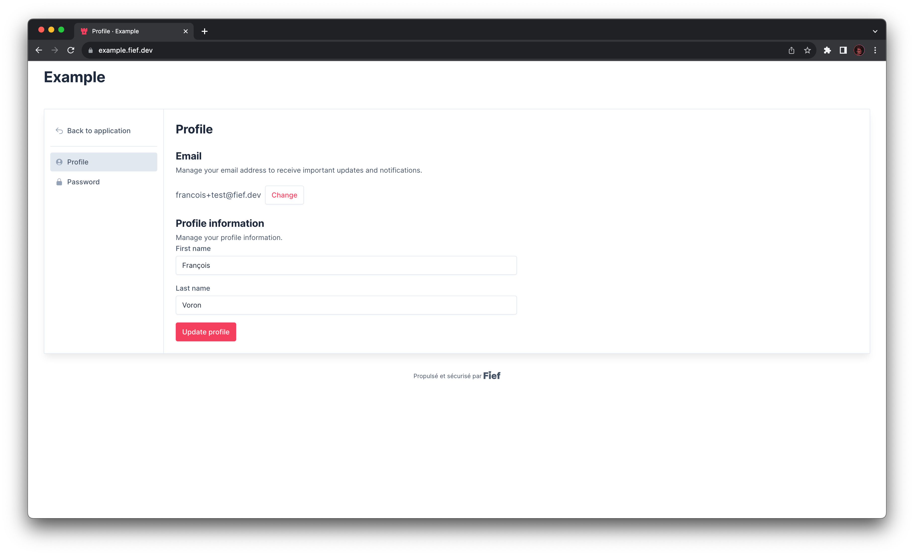
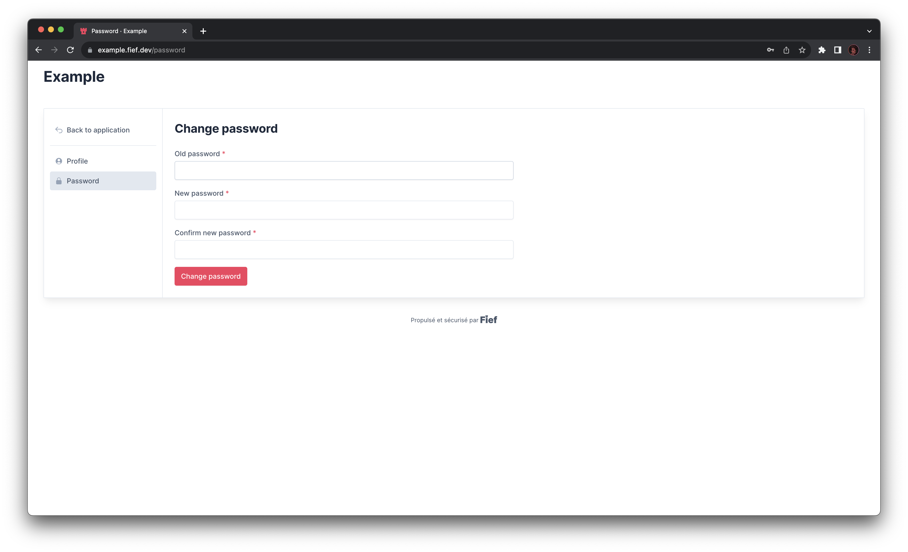

---
hide:
  - navigation
---

# User journey

In this section, we'll highlight the main features and actions your users will be presented while authenticating with Fief.

## Registration

When a user visits your application for the first time, they'll need to register, i.e. create an account on your Fief's tenant.

They'll need to fill a form with the following information:

* Their email address
* A password
* The custom [User Fields](./configure/user-fields.md) you configured on your workspace.

--8<-- "reusables/password-strength-validation.md"

When the user has successfully filled the form, they'll need to [verify their email address](#email-verification).

### Social registration

If you configured [OAuth Providers](./configure/oauth-providers.md), users may be able to register using their social account, like Google or Facebook. They will be taken through the external provider authentication process before being redirected to the registration form to fill their details.

!!! warning "*Sign in with...* and *Sign up with...* doesn't have the same behavior"
    It's important to bear in mind that the social buttons doesn't have the same behavior if they are used from the register or login page. When used from the registration page, they will go through the registration process. If they already had an account, they will get an error stating that their email address is already registered.

## Login

When a user comes back to your application, they'll need to login again to their account. They'll need to fill the form with their email address and password.

Once done, they will be **redirected to your application**, on the redirect URI you specified.

!!! info "Email verification"
    It may happen that an existing account has an unverified email. If so, the user must pass an email verification process, [as explained below](#email-verification), to complete login.

### Social login

If you configured [OAuth Providers](./configure/oauth-providers.md), and if they used it during [registration](#social-registration), users will be able to login using their social account, like Google or Facebook. They will be taken through the external provider authentication process before being **redirected to your application**.

!!! warning "*Sign in with...* and *Sign up with...* doesn't have the same behavior"
    It's important to bear in mind that the social buttons doesn't have the same behavior if they are used from the register or login page. When used from the login page, Fief will check if an account linked to this social account exists. If not, they will get an error stating that such account does not exist.

## Email verification

Email verification is crucial to make sure the user has correctly entered their address and that they actually own it. They will automatically receive an **email on their inbox** with a **verification code**. Users will need to input this code in the form to verify their address.

Once done, they will be **redirected to your application**, on the redirect URI you specified.

## Forgot password

It (often) happens that user forget the password they used to register. To solve this situtation, Fief has the classic forgot password mechanism. First, the user needs to input the email address of their account.

Then, they receive an **email on their inbox** with a link to reset their password.

!!! warning "This form is always successful"
    Even if the user input an email address that does not exist on the tenant, they will be presented with a success message. This is a security measure to avoid malicious users to enumerate existing accounts.

--8<-- "reusables/password-strength-validation.md"

Once done, they are redirected to the [login](#login) page.

## User dashboard

Fief has built-in account management pages allowing users to manage their information. It's directly accessing from the [Base URL](./configure/tenants.md#base-url) of your tenant, e.g. `https://example.fief.dev`.

### Change email address

Users can change their email address. To do this, from the **Profile** section, they can click on the **Change** button. A form will show up where they can input their new email address and confirm their password.

To confirm the change, they'll need to verify the email address, in a similar way to what we explain in the [Email verification](#email-verification) section. This new email address is **not saved** until the verification process is done.

### Update profile

If you configured custom [User Fields](./configure/user-fields.md) on your workspace, users will be able to update them from this page.

### Change password

Users can change their password. To do this, from the **Password** section, they can confirm their old password and input their new one, with a confirmation.

--8<-- "reusables/password-strength-validation.md"

### Back to application

If you configured the [Application URL](./configure/tenants.md) on your tenant, a button is displayed so the user can go back to your application.
